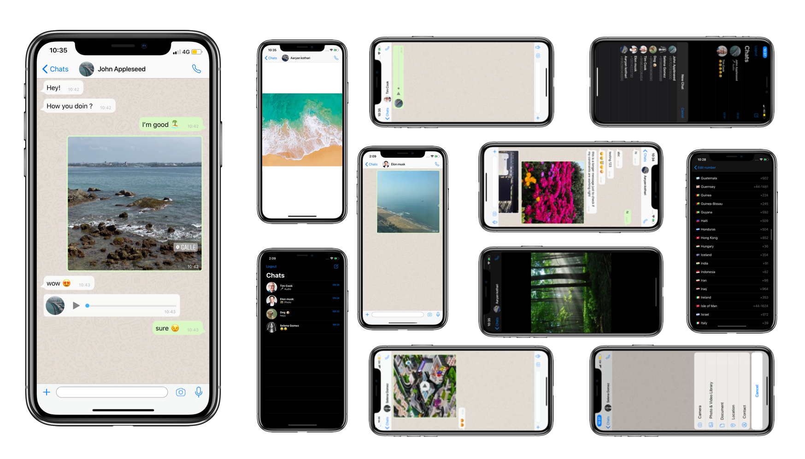

# Chat-App

[](https://swift.org/)

## ACM Summer Project 💻
```
Realtime Chat application using firebase.
```

 ## Screenshots
 <p float="left">
       
 </p>
 
 
 [](https://github.com/aaryankotharii/Chat-App/blob/master/LICENSE)
[](https://swift.org)
[](https://github.com/aaryankotharii) 

## Includes
- realtime Chat
- Sending photos
- Sending Videos
- Sending Audios
- Phone Authentication

## Author

* [Aaryan Kothari](https://github.com/aaryankotharii)

## License

   Copyright 2020 Aaryan Kothari.

   Licensed under MIT License: https://opensource.org/licenses/MIT

